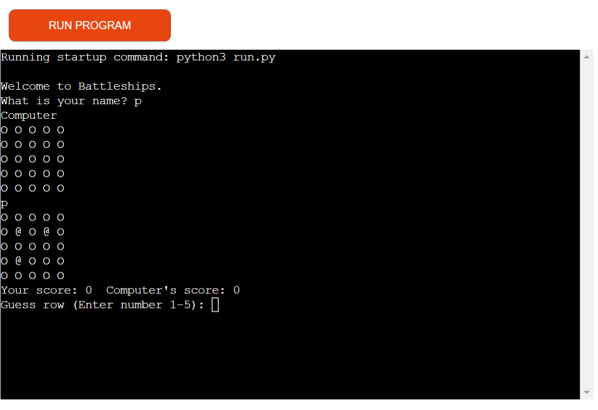
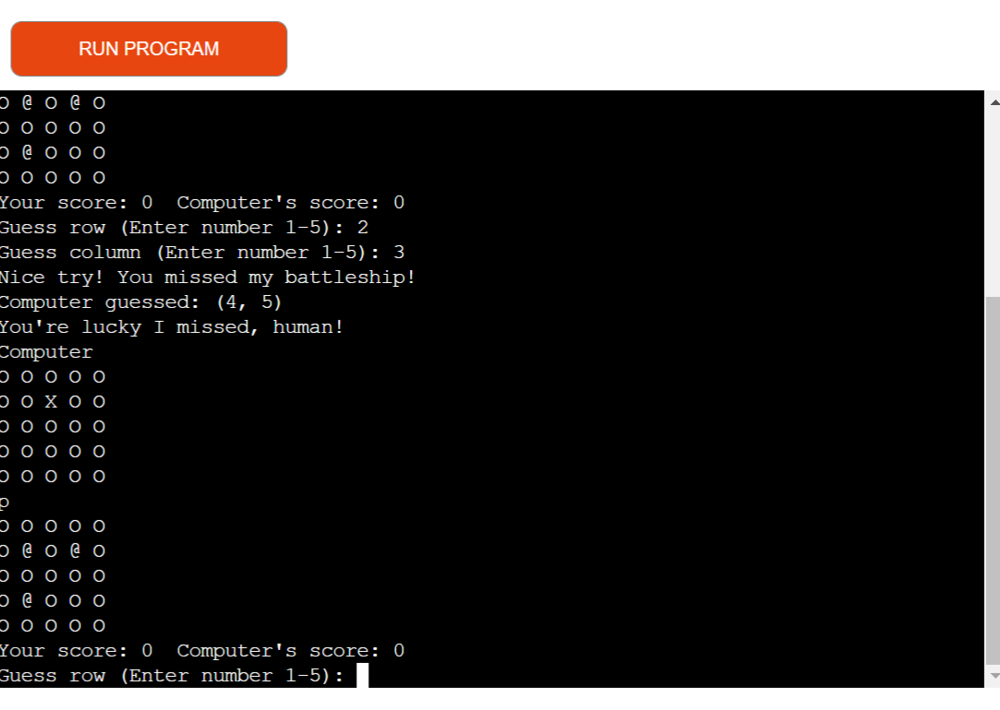
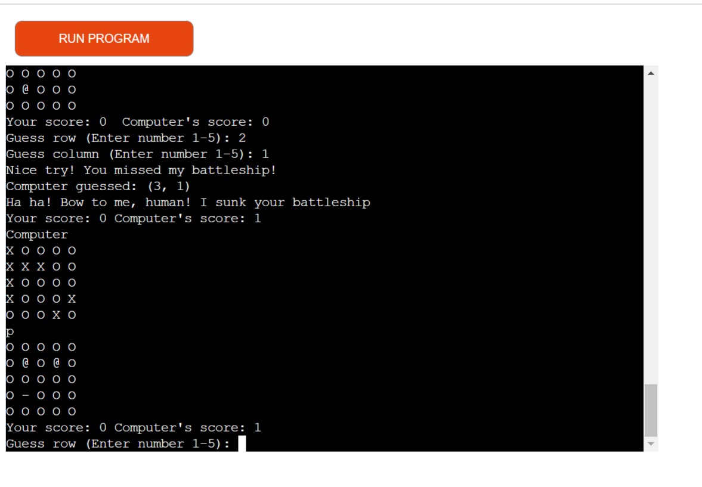
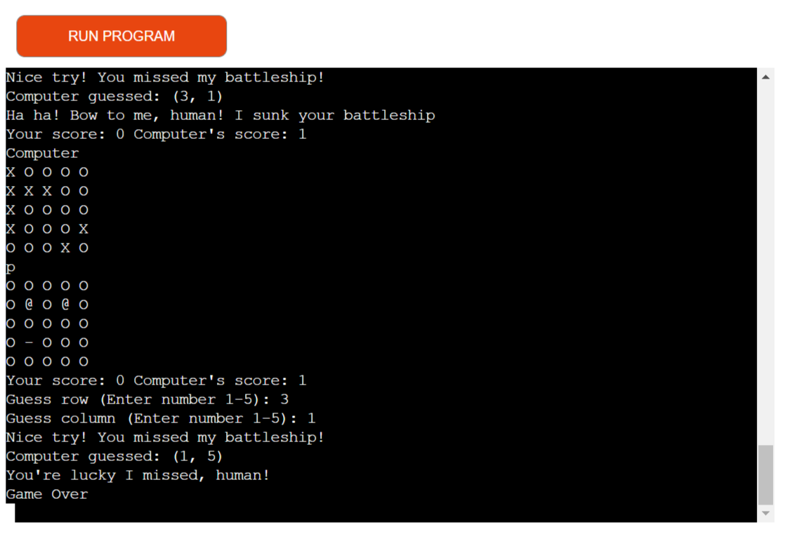

- # Battleships

  ## Introduction

  Based on the traditional pencil and paper game, this version is a Python terminal game which runs in Heroku.

  ## [Table of Contents](#1-ux)

  - 1. UX

    - 	1.1. Strategy
      - Project Goals
        - User Goals
        - User Expectation
    - 1.2 How to Play

  - 2. Features
       - Existing features
       - Future features

  - 3. Technologies Used

  - 4. Testing

  - 5. Development Cycle

  - 6. Deployment

  - 7. End Product

  - 8. Known Bugs

  - 9. Credits

  ## 1.1 Strategy
  [Back to top](#table-of-contents)

  #### Project Goals

  The goal of the program is to entertain the user with a simple guessing game based on the traditional board/pencil and paper game, Battleships. 

  #### User Goals and Expectations

  - Entertain themselves with a simple guessing game.
  - Easily interact with the program.
  - Receive feedback from the computer about game events.

  ## 1.2 How to Play
  [Back to top](#table-of-contents)

  The object of the game is to guess the coordinates of the computer's ship, which is placed randomly on a 4x4 grid, within 8 guesses. Meanwhile, the computer will attempt to guess the randomised coordinates of the player's ship. 

  The game begins with the computer prompting the user to enter their name. Then, the computer generates two equally sized game boards - one for the player and one for the computer itself. 

  Simultaneously, the computer randomly allocates a battleship to a particular position on its board and one to a random position on the player's board (indicated by '@'). Then, the user is prompted to guess the coordinates of the computer's battleship.

  If the user guesses correctly, the computer will signify the player's success with a printed message on screen. Conversely, if the user guesses incorrectly, the computer will indicate an incorrect guess with a different printed message.

  Once the player has completed their turn, the computer will reveal the coordinates of its ship before making a guess of its own. A different message will be printed on screen according to whether or not the computer guesses the coordinates correctly.

  If the user is unable to guess the computer's coordinates within 8 turns, the computer will display the text 'game over' to the user to indicate the end of the game.

  ## 2. Features
  [Back to top](#table-of-contents)

  ### Existing Features

  - Board randomisation
    - The computer randomly places a ship on both the computer's and the player's board.
    
    - The computer's ships are hidden from the player (and vice versa).
    
      
  - Single player mode
    -  The player can play against the computer.
    - The game accepts input from the user.
    - The player is allowed a maximum of 8 turns.
  - Interactivity
    - The computer prompts the user to input coordinates.
    
    - The computer prints messages for the player depending on certain outcomes within the game.
    
      
  - Data
    - Lists used to store and process data
  - Functions
    - Numerous functions are used including functions to randomise coordinates within a specified range
  - Loops
    - For loops are also used as part of the code to generate boards.
  - Conditional statements
    - If and else statements are used to determine what happens based on user inputs or game events.
  - Scoring and turn counting
    - Variables for scoring and for counting the turns a player takes are present in the code. Operators are used to increment these variables accordingly. Once a player reaches 8 turns, the game is over.
    
      

  

  ### Future Features

  - Enable players to choose the size of the game board
  - Allow players to choose where to place their ships on their game board
  - Have ships of differing sizes
  - Revealing the positions of undiscovered battleships at the 'game over' screen

  ## 3. Technologies Used
  [Back to top](#table-of-contents)

  - Python
  - [GitHub](https://github.com/) (project repository)
  - [GitPod](https://gitpod.io) (code line interface)
  - [Typora](https://typora.io/) (for creating this readme file)
  - [Code Beautify](https://codebeautify.org/python-formatter-beautifier) (for improving code presentation and readability)
  - [PEP8 Online ](http://pep8online.com/)(for error checking)

  ## 4. Testing

  PEP8 Online was used to check the code for errors. In addition to using PEP8, I frequently ran the program in GitPod after making changes to ensure the program functioned as intended. Specific aspects of the code I tested were:

  - Scoring system
    - I printed out the computer's battleship positions so that a correct guess would be easy. Then, I entered the coordinates supplied to see whether or not the score would increment.

  - Turn counting
    - I ran the code and played the game in the terminal until 8 turns were reached. The code printed out 'game over' so I knew the turn counting system was working correctly.

  - Player and computer success messages
    - This was tested by playing the game to see what would occur upon a correct or incorrect guess given by the user or the computer.

  ## 5. Development Cycle

  There were three main stages to developing this game.

  1. **Set up:**

     This stage involved setting up the game board and generating random coordinates to play battleships on the board. During this stage, I also wrote code to enable the user and the computer to guess the opponents position.

  2. **Adding additional features:**

     During this stage, I added input validation systems and wrote code to allow the user to input their name. I also began implementing a scoring system and a turn counting system.

  3. **Debugging and Testing:**

     Throughout all stages, I tested my code by running the programme in my local terminal to check the outcome. Final tests were carried out using PEP8 Online. 

  ## 6. Deployment

  This Battleships game was deployed through Heroku.

  ## 7. End Product

  ## 8. Known Bugs

  There are no known bugs remaining.

  ## 9. Credits

  - The code to generate the board and to enable a guess from the user came from [Guimaion on GitHub](https://gist.github.com/guimaion/9275543).
  - The code to count the number of turns in the game came from [Trinket](https://trinket.io/python/051179b6d3).
